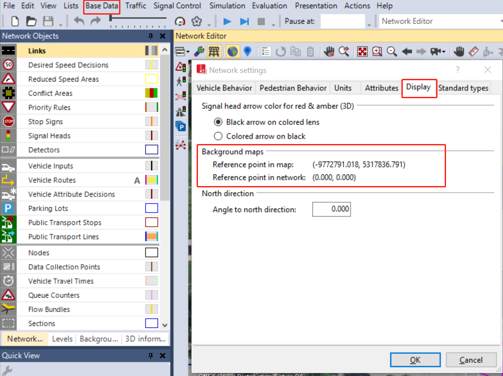
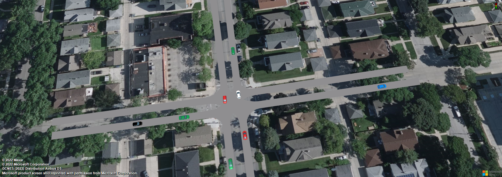

# vissim2gmns

vissim2gmns converts VISSIM files (.inpx, .fzp, .fhz) into GMNS format with WGS 1984 coordinates for easy GIS visualization.

Specifically:

1. convert **.inpx** to .geojson and .csv files
2. convert **.fzp** file to .geojson and .csv files.  comment: will return two files, one is geojson file and anther is csv file.
3. convert **.fhz** file to .csv file.

> [!Warning]
>
> We have deprecated the development of [vissim2geojson](https://pypi.org/project/vissim2geojson/) and the latest update have move to [vissim2gmns](https://github.com/xyluo25/vissim2gmns)

## Background Knowledge Before Use This Tool

1. **Vissim Simulation**

   This tool is to conver files geneated by PTV Vissim.

   You will get the layer file (.inpx):

   the .inpx can only open by PTV Vissim and you can use this tool to convert layer file to wgs1984 so that you can open  the layer using different platform (QGIS, Kepler.gl, ArcMap...)

   You will get simulation results (such as .fzp and .fhz, these files can open by PTV Vissim but not other platforms). You can use this tool to convert .fzp file to .geojson and .csv, .fhz file to .geojson and .csv, and then perform analysis based on the simulation results.
2. **Prepare data for this tool**

   In order to use this tool , you need to prepare information from VISSIM for the map conversion.

   There are for digital numbers from Background maps:

   Every time you are using PTV Vissim, the software will generate these nubmers at Base Data -> Network settings -> Display

> [!NOTE]
>
> You will need to replace following numbers

   **Reference point in map**: (-9772791.018, 5317836.791)

   **Reference point in network**: (0.000, 0.000)                                     you will need to replace these numbers

   

## How to use the tool

1. install from pypi
   `pip install vissim2gmns`
2. use case

   Sample user case at intersection
   

   ```python
   import  vissim2gmns as vg

   if__name__=="main":

       file_folder ="./datasets/one_intersection/"
       file_inpx ="./datasets/one_intersection/xl_002_001.inpx"
       file_fhz ="./datasets/one_intersection/xl_002_001.fhz"
       file_fzp ="./datasets/one_intersection/xl_002_001.fzp"

       # prepare map reference info from Vissim
       x_refmap =-9772791.018
       y_refmap =5317836.791

       x_refnet =0
       y_refnet =0

       # for covert fzp files, if you don't need to convert fzp file, leave these value to default values.
       x_col_name ="POS"
       y_col_name ="POSLAT"

       # using vissim folder as input path, will generate four files: inpx.geojson, fzp.geojson, fzp.csv, fhz.csv.
       # all result files will save to the same folder as the input folder.

       net = vg.VISSIM2GMNS(file_folder, x_refmap, y_refmap, x_refnet, y_refnet, x_col_name, y_col_name)
       net.vissim_to_gmns()

   ```

Enjoy it!
